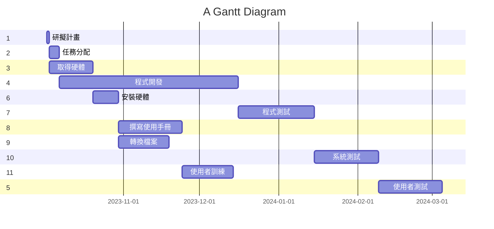
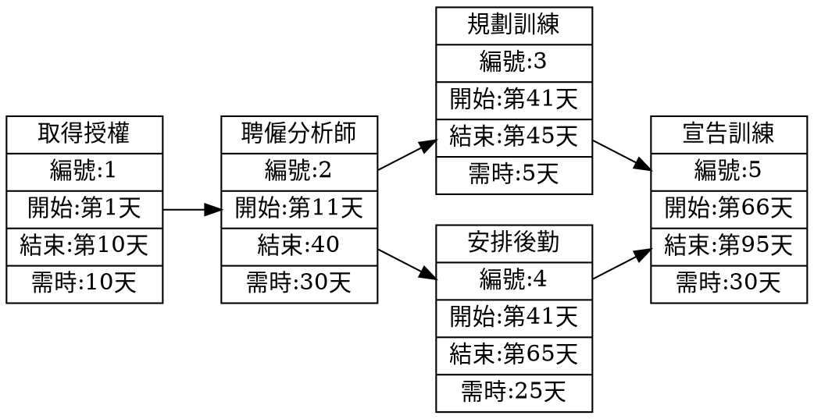

# 甘特圖

```mermaid
gantt
    title A Gantt Diagram

    section 1
    研擬計畫    :a1, 2023-10-02, 1d
    section 2
    任務分配    :a2, after a1  , 4d
    section 3
    取得硬體    :a3, after a1 , 17d
    section 4
    程式開發    :a4, after a2 , 70d
    section 5 
    安裝硬體    :a5, after a3 , 10d
    section 6
    程式測試    :a6, after a4 , 30d
    section 7
    撰寫使用手冊:a7, after a5 , 25d
    section 8
    轉換檔案    :a8, after a5 , 20d
    section 9
    系統測試    :a9, after a6, 25d
    section 10
    使用者訓練   :a10, after a7 , 20d
    section 11
    使用者測試    :a11 , after a9, 25d
```

# PERPT 圖

``` graphviz 
digraph {
	node[shape=record];
	rankdir="LR";
    no1 [label = "取得授權 | 編號:1 | 開始:第1天 | 結束:第10天 | 需時:10天"]
    no2 [label = "聘僱分析師 | 編號:2 | 開始:第11天 | 結束:40 | 需時:30天"]
    no1->no2
    no3 [label = "規劃訓練 | 編號:3 | 開始:第41天 | 結束:第45天 | 需時:5天"]
    no4 [label = "安排後勤 | 編號:4 | 開始:第41天 | 結束:第65天 | 需時:25天"]
    {rank=same;no3 no4}
    no2->no3
    no2->no4
    no5 [label = "宣告訓練 | 編號:5 | 開始:第66天 | 結束:第95天 | 需時:30天"]
    no3->no5
    no4->no5
}
```

# 關鍵路徑圖

